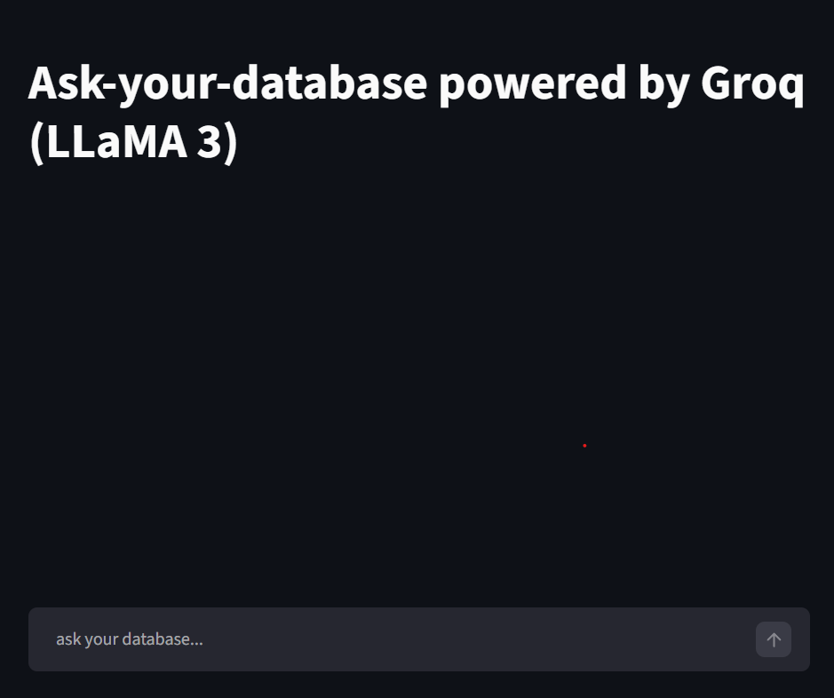
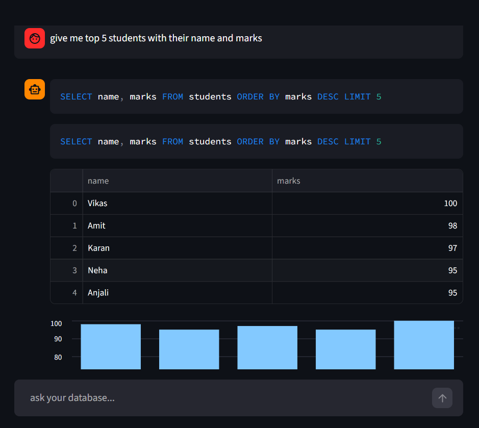

# Ask-your-database (LLama 3.0)

A ChatGPT-style web application that converts natural language queries into SQL and executes them on a local SQLite database.

Built using Groq (LLaMA 3) initially id it was googles genai but changed the LLM later because of the limitation of the free tokens on genai, Streamlit, and Python, this project allows users to interact with databases without writing SQL manually.

## front-end UI(with streamlit)

### Example Query

---

## Features

* Chat-based interface (like ChatGPT)
* Natural Language → SQL generation (LLM powered)
* Schema-aware query generation (prevents hallucination)
* Auto SQL error correction (retry system)
* Confidence filter (avoids invalid queries)
* Clean tabular output using Pandas
* and also gives data using charts if the output contains 2 columns
* Fast responses using Groq API

---

## Tech Stack

* Python
* Streamlit
* SQLite
* Groq API (LLaMA 3)
* Pandas
* dotenv

---

## Project Structure

├── app.py # Main Streamlit app
├── llm.py # LLM (Groq) integration
├── db.py # Database connection & query execution
├── create_prompt.py # Prompt engineering
├── sample_database.py # Database creation & sample data
├── .env # API keys (not included in repo)
├── requirements.txt

---

##  Installation & Setup

### 1. Clone the repository

git clone https://github.com/your-username/text-to-sql-llm.git
cd text-to-sql-llm

---

### 2. Create virtual environment

python -m venv venv
venv\Scripts\activate # Windows

---

### 3. Install dependencies

pip install -r requirements.txt

---

### 4. Add API Key

Create a `.env` file:
GROQ_API_KEY=your_api_key_here

---

### 5. Run database script
python sample_database.py

---

### 6. Run the app
streamlit run app.py

---

##  Example Queries

* Show all students
* List students with marks above 80
* Show students and their courses
* Average marks by department
* Courses with more than 5 credits

---

##  How It Works

1. User enters a natural language query
2. Prompt is generated with database schema
3. LLM converts it into SQL
4. Query is executed on SQLite database
5. If error occurs → retry system fixes query
6. Results are displayed in table format

---

##  Limitations

* Works on structured datasets only
* Limited to SQLite syntax
* LLM may still fail on complex queries

---

##  Future Improvements

*  Add charts & data visualization
*  Support for multiple databases (MySQL, PostgreSQL)
*  User authentication
*  Better confidence scoring
*  Deployment (Streamlit Cloud / Render)

---

## Author

**Prateek Saha**
